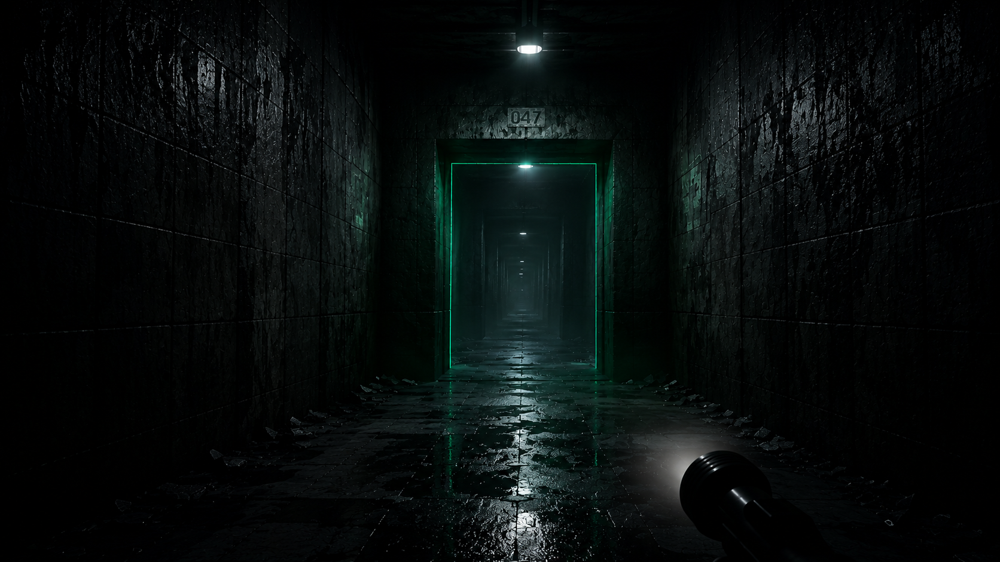

# CORRIDOR - 暗夜回廊



## 你在一个没有窗户的走廊里醒来。

空气湿冷，灯管闪烁发出电流声。你不记得自己怎么来到这里，只记得一道白光，然后只剩下这条走廊，无限延伸，没有尽头。

往前走，脚步声在墙壁间回荡。你停下来，声音也停了。你继续走，声音再次响起，但这次慢了半拍。**这不是回声。是回应。**

墙壁在渗水，地面随时塌陷成深渊。手电筒照亮前方三米，之外是无尽的未知。夜视仪电量在倒数。

走廊尽头，一双红色的眼睛出现了。它在看你。它不急，因为它知道这条走廊会替它做剩下的事。

迷宫在你身后重组，刚才的路已消失。墙壁移动着，像一只巨大的生物在消化猎物。你不确定这里有没有出口。

但你体内有什么在燃烧。按下 Q，五道金色闪电撕碎一切。这不是人类的力量。你到底是什么？你不知道。你只知道一件事——

**你要活下去。**

> *暗夜回廊。每一局都是全新的恐惧。*

---

##  游戏特色

- **程序化迷宫生成** — 递归回溯算法，每次游戏都是全新布局，定时自动重组
- **三种猎手** — 潜行者跟踪、冲刺者追击、伏击者预判你的逃跑路线
- **生存工具** — 手电筒、夜视仪（带电池系统）、金色铁拳终极技能
- **三档难度** — 梦呓 / 惊醒 / 永堕，从观光到噩梦
- **沉浸式氛围** — 雾气、SSAO、电影级死亡演出、程序化音效
- **智能怪物 AI** — 七状态行为机、A* 寻路、视觉/听觉双感知系统

##  操作

| 按键 | 功能 |
|------|------|
| `W A S D` | 移动 |
| `鼠标` | 视角控制 |
| `Shift` | 冲刺 |
| `Ctrl` | 蹲下 |
| `空格` | 跳跃 |
| `F` | 开关手电筒 |
| `N` | 开关夜视仪 |
| `Q` | 终极技能（金色铁拳） |
| `鼠标滚轮` | 视野缩放 |
| `Esc` | 暂停菜单 |

##  难度系统

| 难度 | 迷宫 | 怪物 | 陷阱 | 特殊 |
|:---:|:---:|:---:|:---:|:---:|
| 梦呓 | 11×11 | 无 | 10% | 安全探索 |
| 惊醒 | 15×15 | 有 | 25% | 学会恐惧 |
| 永堕 | 19×19 | 强化 | 35% | 传送陷阱 |

##  运行

1. 下载 [Godot 4.6](https://godotengine.org/download)
2. 打开 Godot 编辑器，导入项目目录
3. 按 F5
4. 深呼吸

##  项目结构

```
corridor/
├── project.godot              # 项目配置
├── corridor.tscn              # 主游戏场景
├── corridor_generator.gd      # 迷宫生成 + 3D 构建
├── player.gd                  # 角色控制 + 生命值 + 终极技能
├── monster.gd                 # 怪物 AI 状态机 + A* 寻路
├── minimap.gd                 # 实时小地图 HUD
├── night_vision.gdshader      # 夜视仪后处理着色器
├── audio_manager.gd           # 程序化音效生成
├── difficulty_manager.gd      # 难度预设
├── godot_boot.tscn/gd         # 启动画面
├── loading_screen.tscn/gd     # 加载画面
├── main_menu.tscn/gd          # 主菜单
├── pause_menu.tscn/gd         # 暂停菜单
├── ending_screen.tscn/gd      # 脱逃成功画面
├── splash_screen.tscn/gd      # 标题画面
├── default_environment.tres   # 世界环境配置
└── map_paths/
    └── maze_explorer.py       # 迷宫算法原型工具
```

##  技术细节

- **引擎**: Godot 4.6
- **渲染**: OpenGL 兼容模式（无需 Vulkan）
- **迷宫算法**: 递归回溯 + 35% 环路概率
- **AI**: 有限状态机 + A* 寻路 + 射线视觉 + 距离听觉
- **音效**: 全部运行时程序化生成，零外部音频依赖
- **着色器**: GLSL 夜视仪后处理（噪点 + 暗角 + 扫描线）

##  开发状态

**v0.1.0** — 早期开发，核心玩法循环已实现

- [ ] 更多迷宫尺寸和自定义选项
- [ ] 更多怪物类型和行为模式
- [ ] 存档和排行榜系统
- [ ] 对话、背包、线索等冒险元素
- [ ] 多平台导出

##  许可证

待定
